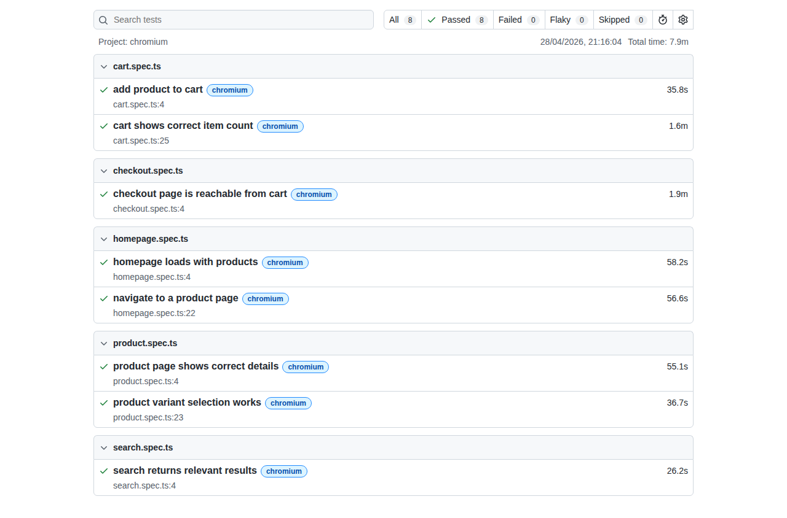

# Passmark Tests — Vercel Commerce Demo

AI-powered regression test suite for [demo.vercel.store](https://demo.vercel.store) built with [Passmark](https://passmark.dev) and Playwright.

Written for the [Breaking Apps Hackathon](https://hashnode.com/hackathons) by Bug0 x Hashnode.

## What's tested

- Homepage loads with products and navigation
- Product page shows name, price, and Add to Cart
- Product variant selection (color + size)
- Add to cart and cart item count
- Checkout page reachable from cart
- Search returns relevant results

## Setup

### Prerequisites
- Node.js 18+
- Docker (for Redis)

### Install

```bash
npm install
```

### Start Redis

```bash
docker run -d --name passmark-redis -p 6379:6379 redis
```

### Configure environment

```bash
cp .env.example .env
# Add your OpenRouter API key to .env
```

### Run tests

```bash
export REDIS_URL=redis://localhost:6379
npx playwright test --project=chromium
```

## Results

8 tests — all passing. Total time: ~8 minutes. AI steps are cached in Redis, so re-runs skip redundant discovery.



## Findings

- Search on demo.vercel.store returns loosely related results — AI assertion caught this as a real UX issue
- Checkout redirect to Shopify requires 180s timeout — worth noting for CI pipelines
- Cart state does not persist across page navigation in some flows